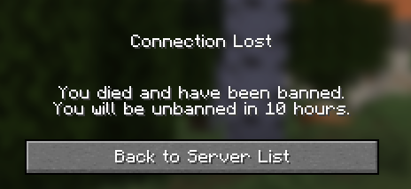
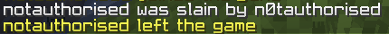

[](https://discord.gg/qdmSv7usbJ)
[](https://github.com/ourhthrtyhjtyjty/DeathBan)
[](https://github.com/ourhthrtyhjtyjty/DeathBan)
[](https://github.com/ourhthrtyhjtyjty/DeathBan)

---

# ☠️ DeathBan

> **The hardcore death-ban plugin, rebuilt for the modern era.**

DeathBan temporarily — or permanently — bans players when they run out of lives. One death doesn't end it all; players get a configurable number of chances before they're locked out. Whether you're running a hardcore SMP, a UHC event, or a custom punishment system, DeathBan has you covered.

---

## ✨ Features

- 💀 **Lives system** — Players have a configurable number of lives before a death-ban kicks in
- ⏱️ **Timed & permanent bans** — Set ban durations per group, or use `permanent` to lock players out forever
- 📈 **Escalating bans** — Configure a list of ban times that increase with each ban (10m → 1h → permanent)
- 👥 **Permission groups** — Different lives and ban durations for different ranks (VIP, Staff, etc.)
- 📢 **Server-wide announcements** — Optional broadcast when a player is banned, fully customisable
- 🎨 **Fully customisable messages** — Every message the plugin sends can be edited in `config.yml`
- 🔄 **Live hot-reload** — `/deathban reload` reloads all config, messages, and groups instantly — no restart required
- 🎯 **PlaceholderAPI support** — Expose lives and ban stats to scoreboards, tab lists, and chat plugins
- ⚔️ **Revive system** — Players can sacrifice one of their own lives to unban another player
- 🛡️ **Vanilla ban list integration** — Optionally sync bans to `/banlist` so they persist even without the plugin
- 🌿 **Folia native support** — Region-aware scheduling, works on threaded Folia servers out of the box
- 📦 **Single JAR** — One file runs on Bukkit, Spigot, Paper, Purpur, and Folia across all versions 1.13–1.21.x

---

## 🖥️ Platform Support

| Platform | Supported |
|----------|-----------|
| Bukkit   | ✅ |
| Spigot   | ✅ |
| Paper    | ✅ |
| Purpur   | ✅ |
| Folia    | ✅ |

> Runs on a single JAR — no separate builds for different platforms.

---

## 🎨 Fully Customisable Messages

Every single piece of text the plugin sends to players can be changed in `config.yml`. No hardcoded strings anywhere.

### Kick Screen

When a player runs out of lives and is banned, they see a fully customisable kick screen:



This message is completely up to you. Change the wording, add color codes, make it dramatic — it's all in your config:

```yaml
messages:
  kick: |-
    You died and have been banned.
    You will be unbanned in %time%.
  kick-permanent: |-
    You died and have been permanently banned.
```

The same message also appears on the login screen if a banned player tries to rejoin (`messages.ban` and `messages.ban-permanent`).

---

### Server Announcement

You can optionally broadcast a message to all online players when someone gets banned. **This is turned off by default** — enable it and customise the message whenever you're ready:



```yaml
# Off by default. Set to true to enable.
announce-ban: false

messages:
  announce: '%player% was banned for %time%'
  announce-permanent: '%player% was permanently banned'
```

When enabled, the announce message supports all the usual placeholders (`%player%`, `%time%`, `%lives%`, `%bans%`, etc.) and `&` color codes.

---

## 📋 Commands

| Command | Description | Permission |
|---------|-------------|------------|
| `/lives` | Check your own remaining lives | `deathban.command.lives` |
| `/lives <player>` | Check another player's lives | `deathban.command.lives` |
| `/revive <player>` | Transfer one of your lives to a banned player | `deathban.command.revive` |
| `/deathban reset <player>` | Remove a ban and restore full lives | `deathban.command.admin` |
| `/deathban set <player> <lives>` | Set a player's exact life count | `deathban.command.admin` |
| `/deathban add <player> <lives>` | Add lives to a player | `deathban.command.admin` |
| `/deathban ban <player> <time>` | Manually ban a player for a duration | `deathban.command.admin` |
| `/deathban reload` | Hot-reload all config and messages | `deathban.command.admin` |

---

## 🔑 Permissions

| Permission | Default | Description |
|------------|---------|-------------|
| `deathban.*` | false | All DeathBan permissions |
| `deathban.bypass` | false | Never get death-banned |
| `deathban.command.*` | op | All commands |
| `deathban.command.lives` | true | Use `/lives` |
| `deathban.command.revive` | true | Use `/revive` |
| `deathban.command.admin` | op | All admin sub-commands |
| `deathban.notify` | op | Receive update notifications on join |

---

## 📊 PlaceholderAPI

Requires [PlaceholderAPI](https://www.spigotmc.org/resources/placeholderapi.6245/) to be installed.

| Placeholder | Description | Example Output |
|-------------|-------------|----------------|
| `%deathban_lives%` | Lives remaining before next ban | `7` |
| `%deathban_max_lives%` | Maximum lives for this player's group | `10` |
| `%deathban_deaths%` | Deaths since last ban | `3` |
| `%deathban_bans%` | Total number of times this player has been banned | `2` |

Use these in any PAPI-compatible plugin — scoreboards, tab lists, chat, holograms, etc.

---

## ⚙️ Configuration

### Time Format

Control how ban durations are displayed to players. Multiple styles available:

```yaml
# Relative countdown (default) — "10 hours", "45 minutes"
time-format: 'in 1 hours minutes? seconds?'

# Absolute date — "10 March 2026 at 17:45:00"
time-format: 'date-format long long'

# Compact — "3h 45m"
time-format: 'in 3 hours minutes? seconds?'

# Custom pattern
time-format: 'custom-date-format dd-MM-yyyy HH:mm:ss'
```

---

### Lives & Ban Duration

```yaml
default:
  lives: 10          # Deaths before a ban triggers
  time: 10h          # Ban duration (s, m, h, d, w supported)
  # time: permanent  # Never-expiring ban
```

**Escalating bans** — each entry applies to the nth ban, and once the list runs out, all future bans are permanent:

```yaml
default:
  lives: 10
  time:
    - 10m       # First ban: 10 minutes
    - 1h        # Second ban: 1 hour
    - 12h       # Third ban: 12 hours
    - permanent # Fourth ban and beyond: permanent
```

---

### Permission Groups

Give different ranks their own lives and ban times. The highest-priority matching group wins:

```yaml
groups:
  vip:
    permission: deathban.group.vip
    lives: 15
    time: 2h
    priority: 1

  staff:
    permission: deathban.group.staff
    lives: 20
    time: 30m
    priority: 2
```

---

### Messages

Every message supports `&` color codes and the following placeholders:

| Placeholder | Description |
|-------------|-------------|
| `%player%` | Player's name |
| `%time%` | Ban duration (formatted by `time-format`) |
| `%lives%` | Lives remaining |
| `%maxlives%` | Maximum lives |
| `%deaths%` | Current death count |
| `%bans%` | Total ban count |

```yaml
messages:
  # Shown on the login screen when the player tries to reconnect while banned
  ban: |-
    You were banned because of your death.
    You will be unbanned in %time%.
  ban-permanent: |-
    You were permanently banned because of your death.

  # Shown as the instant kick when the ban is applied
  kick: |-
    You died and have been banned.
    You will be unbanned in %time%.
  kick-permanent: |-
    You died and have been permanently banned.

  # Optional server-wide broadcast (requires announce-ban: true)
  announce: '%player% was banned for %time%'
  announce-permanent: '%player% was permanently banned'
```

---

### Ban Announcements

Off by default. Enable and customise whenever you like — just set `announce-ban: true` and edit the message:

```yaml
announce-ban: false   # Change to true to enable

messages:
  announce: '%player% was banned for %time%'
  announce-permanent: '%player% was permanently banned'
```

---

### Revive System

Players can sacrifice one of their own lives to unban another player with `/revive <player>`. A confirmation prompt prevents accidental self-banning:

```yaml
revive-confirm: 10    # Seconds to confirm if the revive would ban the sender (0 = no confirm)
revive-lives: all     # Lives the revived player gets back (all / positive / negative)
```

`revive-lives` examples:
- `all` — full lives restored
- `3` — exactly 3 lives
- `-2` — max lives minus 2

---

### Vanilla Ban List Integration

```yaml
use-vanilla-bans: false
```

When `true`, DeathBan syncs every ban to the server's built-in `/banlist`. Banned players are blocked at the server level even if DeathBan is removed. Bans are automatically pardoned when reset or revived.

---

### Commands on Ban

Run custom commands automatically when a player is banned — integrate with any external plugin:

```yaml
default:
  lives: 10
  time: 10h
  commands:
    - 'broadcast %player% has been death banned!'
    - 'lp user %player% parent set banned'
```

---

## 🔄 Hot Reload

All messages, groups, ban times, and settings are reloaded instantly with one command — no server restart needed:

```
/deathban reload
```

Any missing config keys are automatically restored from defaults on every reload.

---

## 📖 Credits

Originally created by **Okx**. This fork modernizes the plugin with Folia support, permanent bans, server-wide announcements, vanilla ban list integration, and full compatibility across all server platforms from 1.13 to 1.21.x.

Join the community: [discord.gg/qdmSv7usbJ](https://discord.gg/qdmSv7usbJ)
